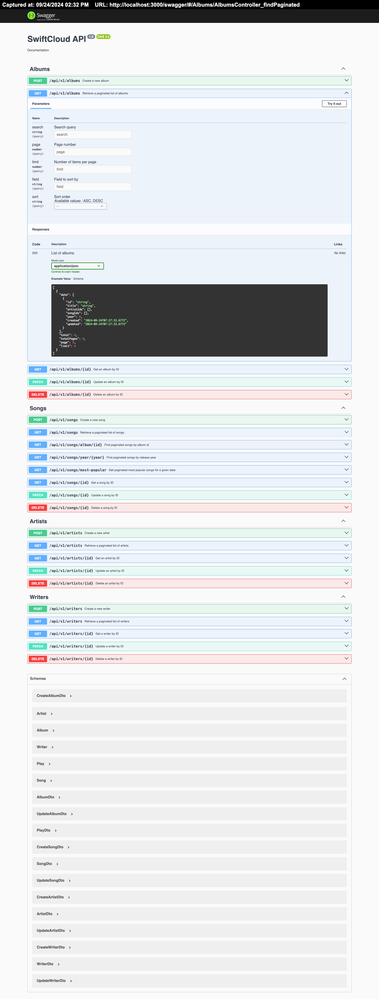

# SwiftCloud

Demo API using TypeScript, NestJS, MongoDB and Swagger

This is a NestJS project that provides a flexible API for song data, including songs, artists, writers, and albums. The API is built using MongoDB and is designed to be scalable and maintainable.

## Features

- **CRUD Operations**: Manage songs, artists, writers, and albums.
- **Advanced Queries**: Support complex queries for powerful frontend capabilities.
- **Normalized Database Schema**: Efficient data management with MongoDB.
- **Modular Architecture**: Easy to extend and maintain.
- **API Documentation**: Integrated Swagger UI for API exploration.
- **Validation and Error Handling**: Robust input validation and consistent error responses.

## Project setup

```bash
# install dependencies
$ npm install
```

## Create the .env File

### Copy the .env-template File

The project requires a `.env` file to store environment variables. To help you get started, a `.env-template` file is provided in the root directory. You can use this template to create your own .env file.

```bash
# copy the .env-template file to .env
$ cp .env-template .env
```

### Update the .env File

Open the `.env` file in your preferred text editor and update the values with your specific configuration:

```plaintext
# ----------------------------------------------------------------
# APP
# ----------------------------------------------------------------

# API
APP_API_NAME=SwiftCloud API
APP_API_VERSION=0.0.1
APP_API_HOST=http://localhost
APP_API_PORT=3000
APP_API_PREFIX=/api
APP_API_IS_SWAGGER_ENABLED=true
APP_API_SWAGGER_DESCRIPTION=Documentation
APP_API_SWAGGER_PREFIX=/swagger

# ----------------------------------------------------------------
# Databases
# ----------------------------------------------------------------

# MongoDB
MONGODB_URI=<mongodb URI>
```

## Compile and run the project

```bash
# build
$ npm run build

# development
$ npm run start

# watch mode
$ npm run start:dev

# production mode
$ npm run start:prod
```

## Run tests

```bash
# unit tests
$ npm run test

# e2e tests
$ npm run test:e2e

# test coverage
$ npm run test:cov
```

## Import data

To import songs data from a CSV file, use the following command:

```bash
# import data
$ npm run import path/to/your/file.csv
```

### Normalization and Replacements in Names and Titles

During the import process of songs data from the CSV file, several normalization steps are performed to ensure consistency and accuracy in the database. This involves cleaning up artist names, writer names, album titles, and song titles by removing footnotes, special characters, and unnecessary whitespace. Understanding these replacements is crucial for maintaining data integrity.

#### Replacements in Names

##### Removing Footnotes from Names

Footnotes often appear in names within square brackets, such as `[a]`, `[b]`, etc. These footnotes are removed to standardize artist and writer names.

Example:

- Original name: Taylor Swift[a]
- Normalized name: Taylor Swift

##### Normalizing Artist and Writer Names

- Line Breaks: Line breaks within names are replaced with spaces to handle multiline entries.
- Whitespace: Leading and trailing whitespace is removed.
- Splitting Names: Multiple names are split using commas, the word and, or the ampersand symbol &.

Example:

- Original name: Taylor Swift, Liz Rose

```plaintext
Taylor Swift
Max Martin
Shellback
```

- Normalized names: Taylor Swift, Max Martin, Shellback

### Replacements in Album Titles

#### Removing Line Breaks and Spaces

- Line Breaks: Line breaks within album titles are replaced with a separator (e.g.,`-`).
- Whitespace: Leading and trailing whitespace is removed.

Example:

- Original title:

```plaintext
Speak Now
(Deluxe edition)
```

- Normalized title: Speak Now - Deluxe edition

#### Replacements in Song Titles

Song titles undergo similar normalization steps as names and album titles:

- Removing Footnotes: Footnotes within song titles are removed.
- Line Breaks: Line breaks are replaced with spaces.
- Whitespace: Leading and trailing whitespace is removed.

Example:

- Original title:

```plaintext
I Don't Wanna Live Forever
```

- Normalized title: I Don't Wanna Live Forever

### Other Important Replacements

#### Replacing Special Characters

- Ampersands and Conjunctions: When splitting names, variations of `and`, `&` are standardized to ensure consistent parsing.

#### Normalizing Case

- Lowercasing: Album titles are converted to lowercase when matching against predefined mappings or types.

#### Removing Metadata Annotations

- Bracketed Metadata: Annotations or metadata within square brackets in names or titles are removed to clean up the data.

#### Album Types Mapping Details

Here is what each key-value pair represents:

- `none` ➔ Single
  <!-- - `none` ➔ `EAlbumType.SINGLE` -->
  - Indicates the song is released as a single.
- `none[a]` ➔ Remix
  <!-- - `none[a]` ➔ `EAlbumType.REMIX` -->
  - Represents a remix version of a song.
- `none[b]` ➔ Promo
  <!-- - `none[b]` ➔ `EAlbumType.PROMO` -->
  - Denotes a promotional release.
- `none[c]` ➔ Live
  <!-- - `none[c]` ➔ `EAlbumType.LIVE` -->
  - Signifies a live performance recording.
- `none[d]` ➔ Soundtrack
  <!-- - `none[d]` ➔ `EAlbumType.SOUNDTRACK` -->
  - Indicates the song is part of a movie or game soundtrack.
- `none[e]` ➔ Standard
  <!-- - `none[e]` ➔ `EAlbumType.STANDARD` -->
  - Represents a standard album release.
- `none[f]` ➔ Other
  <!-- - `none[f]` ➔ `EAlbumType.OTHER` -->
  - Covers any other album types not specifically categorized.

### Importance of Replacements

- **Data Consistency**: Ensures that all names and titles follow a uniform format, reducing discrepancies.
- **Accurate Matching**: Facilitates the correct identification of existing records in the database, preventing duplicates.
- **Clean Data**: Removes unnecessary annotations and footnotes that are not essential, leading to a cleaner dataset.
- **Improved Searchability**: Standardized data enhances search functionality and retrieval accuracy within the application.

## Swagger API Documentation

The SwiftCloud API is well-documented using Swagger, providing an interactive interface to explore the API. Below is an overview of the main endpoints available:

Albums

- `GET /api/v1/albums`: Retrieve a paginated list of albums.
- `POST /api/v1/albums`: Create a new album.
- `GET /api/v1/albums/{id}`: Retrieve a specific album by ID.
- `PATCH /api/v1/albums/{id}`: Update an album by ID.
- `DELETE /api/v1/albums/{id}`: Delete an album by ID.

Songs

- `GET /api/v1/songs`: Retrieve a paginated list of songs.
- `POST /api/v1/songs`: Create a new song.
- `GET /api/v1/songs/album/{id}`: Find paginated songs by album ID.
- `GET /api/v1/songs/year/{year}`: Find songs by release year.
- `GET /api/v1/songs/most-popular`: Get the most popular songs for a given date.
- `GET /api/v1/songs/{id}`: Retrieve a specific song by ID.
- `PATCH /api/v1/songs/{id}`: Update a song by ID.
- `DELETE /api/v1/songs/{id}`: Delete a song by ID.

Artists

- `GET /api/v1/artists`: Retrieve a paginated list of artists.
- `POST /api/v1/artists`: Create a new artist.
- `GET /api/v1/artists/{id}`: Retrieve a specific artist by ID.
- `PATCH /api/v1/artists/{id}`: Update an artist by ID.
- `DELETE /api/v1/artists/{id}`: Delete an artist by ID.

Writers

- `GET /api/v1/writers`: Retrieve a paginated list of writers.
- `POST /api/v1/writers`: Create a new writer.
- `GET /api/v1/writers/{id}`: Retrieve a specific writer by ID.
- `PATCH /api/v1/writers/{id}`: Update a writer by ID.
- `DELETE /api/v1/writers/{id}`: Delete a writer by ID.

For a complete and interactive documentation of the API, visit the Swagger UI hosted at /swagger once the application is running.



## Resources

This project was built using TypeScript, Node.js, NestJS, and Swagger. Below are some resources to help you get started and dive deeper into these technologies:

### TypeScript

- [Official TypeScript Documentation](https://www.typescriptlang.org/docs/): Comprehensive guide and reference for TypeScript, covering all aspects from basic types to advanced usage.

### Node.js

- [Node.js Documentation](https://nodejs.org/en/docs/): Official documentation for Node.js, providing resources for learning about core modules, async programming, and Node.js APIs.

### NestJS

- [NestJS Documentation](https://docs.nestjs.com/): Official NestJS documentation, including tutorials, guides, and API references to help you build efficient, scalable Node.js applications.

- [NestJS Devtools](https://devtools.nestjs.com/): Visualize your application graph and interact with the NestJS application in real-time using NestJS Devtools.

- [NestJS Enterprise Support](https://enterprise.nestjs.com): For companies needing dedicated support, NestJS offers official enterprise support options.

- [NestJS Video Courses](https://courses.nestjs.com/): Official NestJS courses for more hands-on learning and experience.

### MongoDB

- [MongoDB Documentation](https://docs.mongodb.com/manual/): Official documentation for MongoDB, providing an overview of its features, guides for getting started, and detailed explanations of various MongoDB concepts.

- [Mongoose Documentation](https://mongoosejs.com/docs/): Documentation for Mongoose, the MongoDB object modeling tool designed to work in an asynchronous environment, providing a schema-based solution to model your application data.

### Swagger

- [Swagger Documentation](https://swagger.io/docs/): Official Swagger documentation that provides guides and examples for integrating Swagger into your APIs and enhancing API documentation.

### Community and Support

- **Discord**: Join the [NestJS Discord Channel](https://discord.gg/G7Qnnhy) for real-time support and discussion with other developers.
- **X (formerly Twitter)**: Follow [NestJS on X](https://x.com/nestframework) for updates and community news.
- **LinkedIn**: Connect with the [NestJS community on LinkedIn](https://linkedin.com/company/nestjs).
- **Jobs Board**: Looking for a job, or have a job to offer? Check out the [NestJS Jobs Board](https://jobs.nestjs.com).

## Stay in touch

- Author - [Yosvel Quintero](https://x.com/yosvelquintero)

## License

SwiftCloud is [MIT licensed](https://opensource.org/licenses/MIT).
